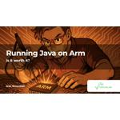
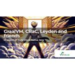

# Table of Contents

| Thumbnail | Title |
| ---------- | ----- |
|  | [Build your own NES Emulator with Kotlin](<./media/9 - Build your own NES Emulator with Kotlin_compressed.pdf>) |
|  | [JVM Iceberg - Modern Performance Edition](<./media/8 - JVM Iceberg - Modern Performance Edition_compressed.pdf>) |
|  | [Running Java on Arm](<./media/7 - Running Java on Arm_compressed.pdf>) |
|  | [JVM in the Age of AI](<./media/6 - JVM in the Age of AI_compressed.pdf>) |
|  | [The State of the Green IT in 2024](<./media/5 - The State of the Green IT in 2024_compressed.pdf>) |
|  | [Digging for Truffles](<./media/4 - Digging for Truffles_compressed.pdf>) |
|  | [GraalVM, CRaC, Leyden and friends](<./media/3 - GraalVM, CRaC, Leyden and friends_compressed.pdf>) |
|  | [JVM Iceberg](<./media/2 - JVM Iceberg_compressed.pdf>) |
|  | [I'm Not Cleaning Up Their Mess!](<./media/1 - I'm Not Cleaning Up Their Mess!_compressed.pdf>) |
